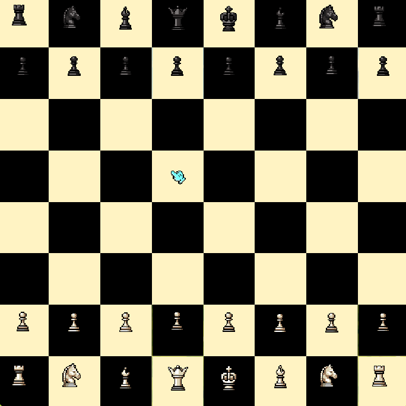

# Xadrez Pixelado


Jogo de xadrez local para duas pessoas, desenvolvido em JavaScript puro. O projeto combina um motor de regras independente da interface com uma identidade visual autoral em pixel art.

**[Jogar no GitHub Pages](https://alonejr.github.io/hub-dev/xadrez/)**



## Objetivo do projeto

O Xadrez Pixelado faz parte do meu portfólio de desenvolvimento front-end. Ele foi criado para exercitar regras de negócio, matrizes, controle de estado, eventos de ponteiro, acessibilidade e separação entre lógica e apresentação.

As peças, o tabuleiro, os botões e os cursores foram desenhados manualmente em pixel art. As paisagens de fundo foram geradas com auxílio de inteligência artificial para complementar a ambientação.

## Funcionalidades

### Regras de xadrez

- Movimentos legais de peão, torre, cavalo, bispo, dama e rei.
- Capturas e bloqueio de caminho para peças deslizantes.
- Detecção de casas atacadas, xeque e auto-xeque.
- Xeque-mate e afogamento.
- Roque pequeno e grande, incluindo as restrições de casas atacadas.
- En passant.
- Promoção para dama, torre, bispo ou cavalo.
- Empate por repetição tripla, regra dos 50 movimentos e material insuficiente.
- Impedimento de captura direta do rei.

### Experiência de jogo

- Arrastar e soltar com mouse, caneta ou toque.
- Movimento alternativo por clique/toque em duas etapas.
- Navegação das casas por teclado com `Tab`, `Enter` e `Espaço`.
- Indicação dos movimentos legais, última jogada e rei em xeque.
- Histórico em notação algébrica, incluindo roques, promoções, xeque e mate.
- Exibição das peças capturadas por cada lado.
- Desfazer jogada e reiniciar partida.
- Painel de estado com mensagens de turno e encerramento.
- Escolha acessível da peça de promoção.
- Layout responsivo para computador e celular.

### Identidade visual

- Sprites próprios para todas as peças.
- Cursores animados diferentes para cada turno: jogador nas brancas e o conjunto visual da futura IA nas pretas.
- Tema claro e escuro persistido no navegador.
- Easter egg interativo no tema escuro.
- Respeito à preferência de redução de movimento do sistema.

> Os sprites de IA representam visualmente o turno das pretas, mas não existe IA jogando nesta versão.

## Arquitetura

O projeto não depende de frameworks nem de bibliotecas de xadrez.

```text
xadrez/
├── engine.js             # Estado e regras puras, sem acesso ao DOM
├── scripts.js            # Renderização, entradas e experiência da partida
├── styles.css            # Layout, pixel art, estados e responsividade
├── index.html            # Estrutura semântica da interface
├── tests/
│   └── engine.test.js    # Testes automatizados do motor
└── assets/               # Sprites, cenários, botões e sons
```

O motor mantém, entre outros dados:

- posição das peças;
- lado a jogar;
- direitos de roque;
- alvo temporário de en passant;
- relógio da regra dos 50 movimentos;
- número do lance;
- histórico e contagem de repetição das posições.

Ele expõe geração de movimentos pseudo-legais e legais separadamente. Cada candidato é aplicado a uma cópia do estado e descartado quando deixa o próprio rei em xeque. A interface apenas consulta e apresenta esse resultado.

O motor também consegue ler e gerar posições no formato FEN. Essa capacidade já é usada nos testes e poderá alimentar desafios ou análise de posições no futuro.

## Testes

Os testes usam o executor nativo do Node.js, sem dependências adicionais:

```bash
node --test tests/engine.test.js
```

Os cenários cobrem:

- contagens de referência da posição inicial (`20`, `400`, `8902` e `197281` nós);
- movimentos que expõem o próprio rei;
- tentativa de captura do rei;
- roques válidos e passagem por casa atacada;
- en passant;
- quatro opções de promoção;
- xeque-mate e notação algébrica;
- afogamento;
- material insuficiente;
- regra dos 50 movimentos;
- repetição tripla.

## Como executar localmente

1. Clone o monorepositório do portfólio:

```bash
git clone https://github.com/AloneJr/hub-dev.git
```

2. Entre na pasta do projeto:

```bash
cd hub-dev/xadrez
```

3. Abra a pasta com um servidor local, como o Live Server do VS Code, e acesse o `index.html`.

## Próxima etapa: IA

A próxima grande evolução planejada é um modo contra o computador. Essa etapa foi deixada intencionalmente fora da implementação atual para que o algoritmo seja estudado e desenvolvido manualmente.

Possíveis etapas futuras:

- função de avaliação da posição;
- minimax;
- poda alpha-beta;
- níveis de profundidade;
- execução em Web Worker para não bloquear a interface;
- animação do cursor da IA escolhendo e movimentando a peça.

Como o motor já gera todas as jogadas legais sem depender da interface, a futura IA poderá trabalhar diretamente sobre estados confiáveis e nunca precisará manipular o DOM para decidir um lance.

## Autor

Feito por [Jeryel A. Silva](https://github.com/AloneJr).
